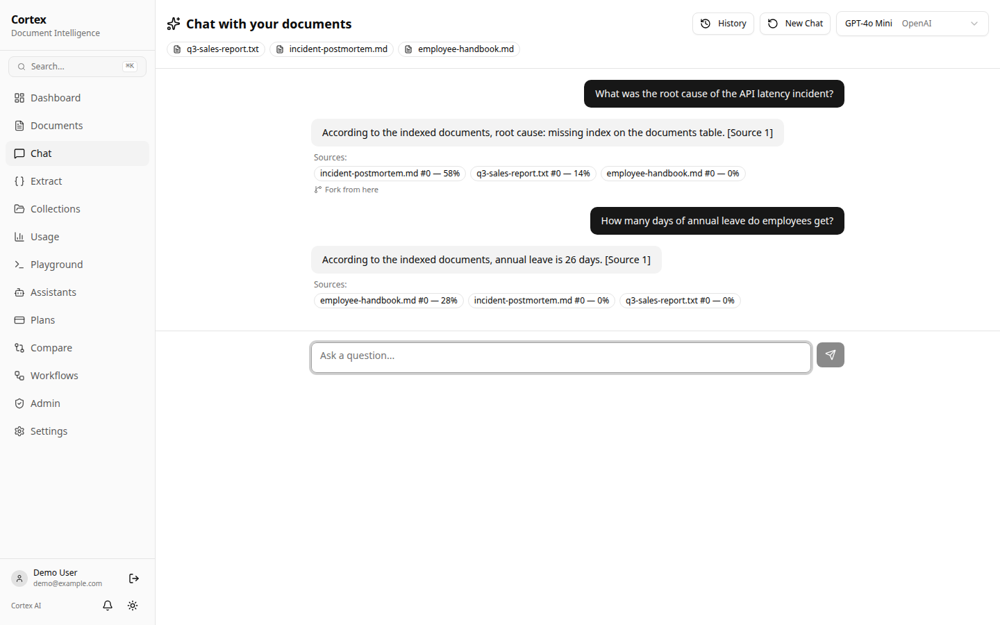
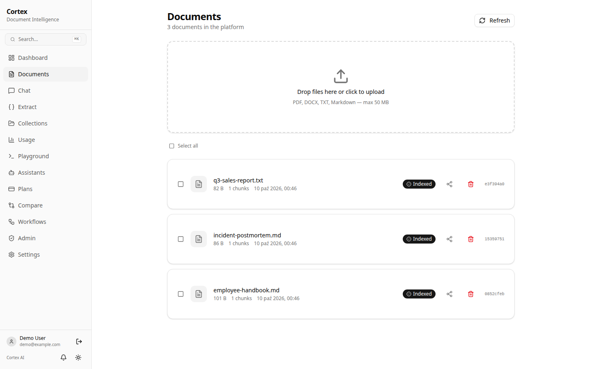
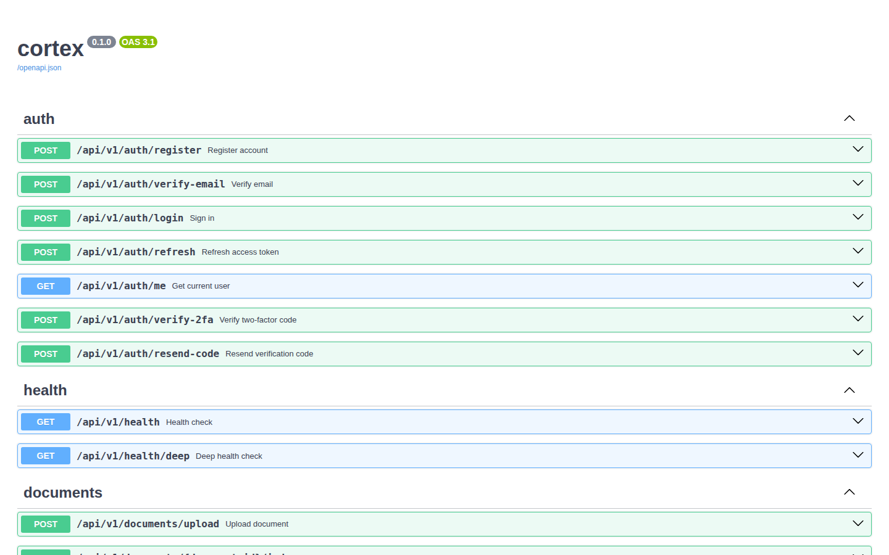
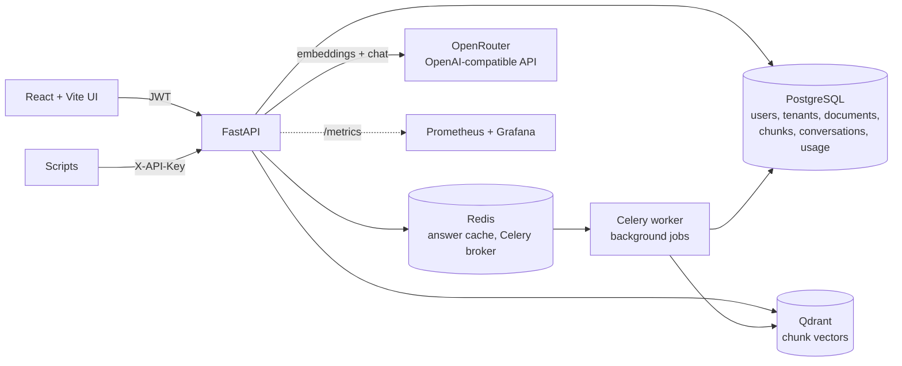

# Agentic RAG Platform (Cortex)

**Upload documents, ask questions about them, and get answers that cite the exact chunks they came from.** A multi-tenant FastAPI backend with Qdrant vector search, PostgreSQL, Redis caching and a React dashboard.

[](https://github.com/MaciejZiel/agentic-rag-platform/actions/workflows/ci.yml)
[](LICENSE)




<sub>Local run with three sample documents. To capture it without an API key, OpenRouter was swapped for a small OpenAI-compatible stub through `OPENROUTER_BASE_URL`; chunking, embedding storage in Qdrant, retrieval, the streamed response and the source chips are the real pipeline.</sub>

| Documents | Interactive API docs |
|---|---|
|  |  |

## What it does

- **Document ingestion**: upload PDF, DOCX, TXT or Markdown; a background job on the Celery worker splits it into chunks (fixed-size with overlap, sentence or paragraph strategy, counted with `tiktoken`), embeds them and stores them in Qdrant while the UI polls the job.
- **Grounded Q&A**: retrieve the top-k chunks for a question, answer with `[Source N]` citations, stream tokens over SSE, keep multi-turn context (last 10 messages) and let the user pick the model per question.
- **Structured extraction**: turn a document into JSON that follows a user-supplied JSON schema.
- **Accounts and tenants**: email + password sign-up with a 6-digit verification code, optional TOTP two-factor authentication with recovery codes, JWT access/refresh tokens for the UI and `X-API-Key` keys for scripts, both resolving to a tenant. Every query, vector search and statistic is scoped to the caller's tenant.
- **Operations**: rate limits (slowapi), Redis answer cache, HMAC-SHA256-signed webhooks, Prometheus `/metrics`, structured logging (structlog) and security headers.

The API has 60 operations across 46 paths; the full list is in Swagger UI at `/docs`.

## Architecture



A question goes through `QAService`: check the Redis cache (only for new conversations, keyed per tenant), embed the question, search Qdrant filtered to the caller's tenant (optionally limited to selected documents), load the matching chunks from PostgreSQL (again only from the tenant's documents), build a prompt with numbered sources plus conversation history, call the model, then store the messages, token usage and estimated cost.

## Tech stack

| Layer | Tools |
|---|---|
| API | Python 3.12+, FastAPI, Pydantic v2, SQLAlchemy 2 (async, asyncpg), Alembic |
| Retrieval | Qdrant, OpenRouter through the `openai` SDK (`text-embedding-3-small`, chat model chosen per request), `tiktoken`, PyMuPDF, python-docx |
| Infrastructure | PostgreSQL 16, Redis 7, Celery, Docker Compose, Kubernetes manifests in `k8s/`; the frontend is built by Cloudflare Pages through its GitHub integration |
| Auth & security | PyJWT, bcrypt, API keys, TOTP 2FA (pyotp, QR codes with segno), slowapi rate limits, CSP and other security headers |
| Observability | structlog, prometheus-fastapi-instrumentator, Prometheus, Grafana |
| Frontend | React 19, TypeScript, Vite, Tailwind CSS v4, shadcn/ui, Recharts, i18next (EN/PL), Vitest |

## Quick start

Requirements: Docker, Python 3.12+, Node.js 22+, and an [OpenRouter](https://openrouter.ai) API key for indexing and answering (upload, auth and the UI work without it).

```bash
git clone https://github.com/MaciejZiel/agentic-rag-platform.git
cd agentic-rag-platform
cp .env.example .env                    # set OPENROUTER_API_KEY; RESEND_API_KEY is optional

docker compose up -d postgres redis qdrant
python -m venv .venv && source .venv/bin/activate
pip install -e ".[dev]"
alembic upgrade head
uvicorn app.main:app --reload --port 8000
```

In a second terminal:

```bash
cd frontend
npm ci
npm run dev                             # http://localhost:3000, proxies /api to :8000
```

Open http://localhost:3000 and register. Without `RESEND_API_KEY` no email is sent; read the verification code from the database:

```bash
docker compose exec postgres psql -U rag_user -d rag_platform \
  -c "SELECT email, email_verification_code FROM users ORDER BY created_at DESC LIMIT 1;"
```

Swagger UI is at http://localhost:8000/docs and a set of ready-made requests is in [`examples/requests.http`](examples/requests.http). `docker compose up -d` without service names also builds the API and Celery worker images and starts Prometheus (:9090) and Grafana (:3001).

## Tests

```bash
pip install aiosqlite                   # the API tests run against SQLite
python -m pytest tests/ --cov=app       # 56 tests
cd frontend && npm test                 # 39 tests (Vitest)
```

The backend tests drive the FastAPI app through `httpx.AsyncClient` with the LLM client and the vector store replaced by mocks, so they need no API keys or running services. Line coverage of `app/` is about 60% (as reported in CI); the upload/index/ask flow, auth validation, chunking and text extraction are covered, while the Celery tasks and several admin endpoints are not yet.

CI (GitHub Actions) runs the backend tests, applies every Alembic migration to a real PostgreSQL 16 and runs `alembic check` to fail on drift between models and migrations, then type-checks, builds and tests the frontend.

## Key technical decisions

- **Qdrant next to PostgreSQL instead of pgvector.** PostgreSQL stays the source of truth for documents and chunk text; Qdrant only holds vectors with `document_id` and `tenant_id` payloads. That keeps similarity search out of the transactional database, at the cost of two stores to keep consistent, so re-indexing first deletes old chunks and vectors, and deleting a document removes both.
- **Tenant isolation in one shared collection.** All tenants share one Qdrant collection; every search and delete carries a mandatory `tenant_id` filter backed by a tenant payload index (`is_tenant`), and chunk rows are loaded only from the caller's documents, so a wrong vector hit cannot leak text. In PostgreSQL every tenant-owned row (documents, conversations, chat queries, extractions, jobs, ...) has a `tenant_id`, and foreign ids answer 404 exactly like missing ones. Vectors indexed before this existed are migrated with `python -m app.scripts.backfill_vector_tenants`.
- **Indexing as a background job.** `POST /documents/{id}/index` records an `index_document` job and returns 202; the Celery worker does extraction, chunking and embedding, and clients poll `GET /jobs/{id}`. A soft failure (e.g. no extractable text) fails the job without retries; a hard failure rolls back partial chunks and is retried by Celery.
- **2FA as a second sign-in step.** With TOTP enabled, login returns only a 5-minute challenge token (which is not an access token); `/auth/2fa/verify` exchanges it plus a TOTP or single-use recovery code for tokens. Codes cannot be replayed, recovery codes are stored as SHA-256 hashes, and wrong codes are rate-limited per IP and lock the account's second factor for 15 minutes after 5 failures.
- **Prices as cited data, unknown costs as null.** Model prices live in `app/config/model_pricing.toml`, each citing the provider's official pricing page. A model without a verifiable price reports `cost_usd: null` (shown as "n/a") instead of a guessed or zero cost; totals sum the known costs.
- **OpenRouter through the OpenAI SDK.** One `AsyncOpenAI` client with a different `base_url` gives access to OpenAI, Anthropic, Google, Meta and DeepSeek models, and the model is a per-request parameter. The trade-off is one more hop and a provider dependency; embeddings stay fixed to one model because vectors from different models cannot be mixed in one collection.
- **Cache only stateless questions.** The Redis key is a SHA-256 of tenant, question, selected document IDs and model, with a 1-hour TTL. Follow-ups inside a conversation skip the cache because the answer depends on history. Cache errors are logged and ignored, so Redis being down slows answers down instead of breaking them.
- **Two auth paths, one tenant.** The UI uses short-lived JWTs with refresh tokens; integrations use API keys. Both resolve to the same `Tenant` dependency, so route handlers do not care which one was used.

## Limitations and next steps

- There is no platform-operator role: `/admin/*` shows the caller's own tenant, and any authenticated tenant can still create additional tenants through `POST /tenants`.
- Rows that existed before tenant scoping and could not be attributed to a tenant (no document reference) keep `tenant_id = NULL` and are invisible to everyone.
- TOTP secrets are stored in plain text in the `users` table (recovery codes are hashed); encrypting them at rest with a separate key is a next step. Email-based 2FA is not implemented.
- A document whose worker dies mid-job stays in `processing`; there is no reaper for stale jobs yet.
- No verified official price exists for Llama 4 Maverick and the DeepSeek V3 0324 snapshot, so their cost is reported as unknown; prices must be updated by hand when providers change them.
- The automated tests use SQLite; only migrations are exercised against PostgreSQL in CI.

## License

Released under the [MIT License](LICENSE).
